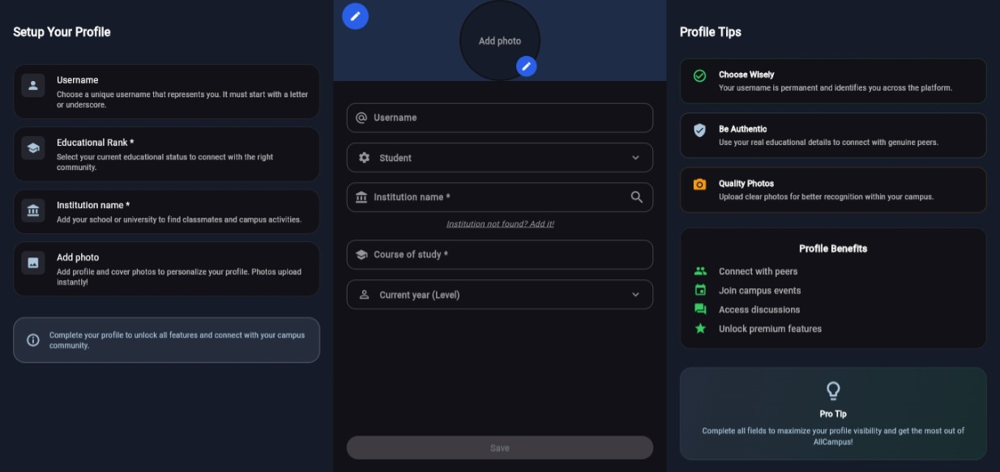
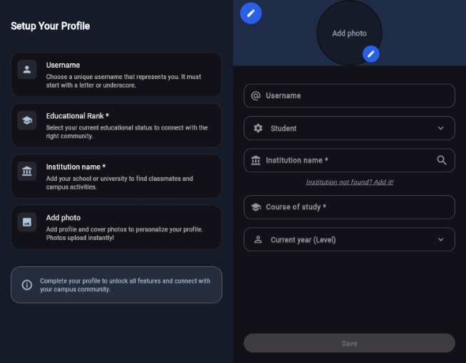
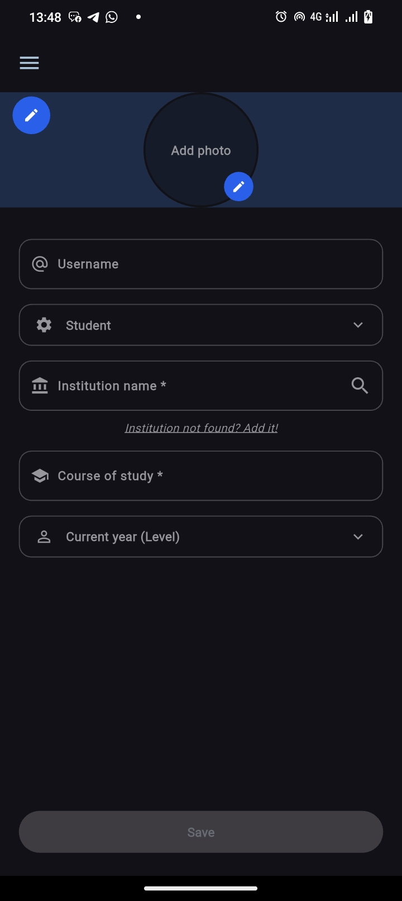
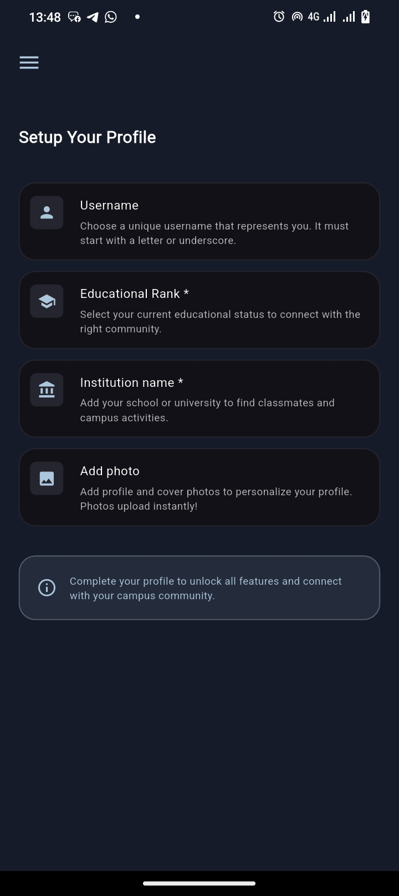
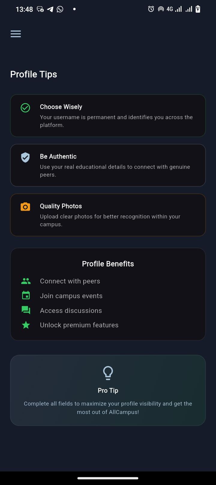
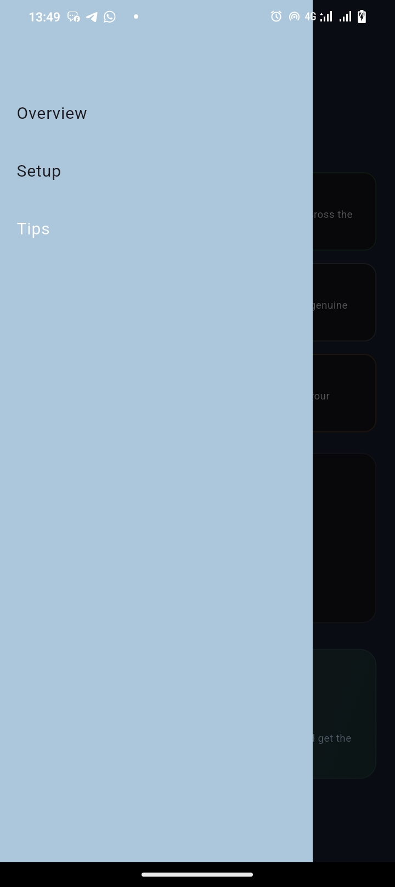

# AllCampus – Profile Setup UI (Flutter Responsive)

A beautiful, fully responsive Flutter profile setup screen with a modern dark theme, designed for students.  
Supports **Desktop (3-column)**, **Tablet (2-column)**, and **Mobile (single column + drawer)** layouts seamlessly.

Live preview: [https://aptech-flutter-project-three.netlify.app/](https://aptech-flutter-project-three.netlify.app/)

## Screenshots

<h3>Desktop View (≥1200px)</h3>


<h3>Tablet View (750px – 1199px)</h3>


<h3>Mobile View (<750px)</h3>






## Features

- Fully responsive 3-column layout (Left: Guide | Center: Form | Right: Tips)
- Clean dark UI with custom color palette
- Mobile drawer navigation
- Reusable custom widgets for inputs, dropdowns, cards, tips, etc.
- Single codebase – works perfectly on Android, iOS, Web, macOS, Windows, Linux

## Tech Stack

- Flutter 
- Dart 

## Project Structure

```
lib/
├── columns/
│   ├── left_column.dart      → Profile setup guide cards
│   ├── center_column.dart    → Main form (username, institution, etc.)
│   └── right_column.dart    → Tips & benefits section
├── constants/
│   └── colors.dart           → Central color palette
├── custom_widgets/
│   ├── left.dart             → Reusable cards for left column
│   ├── center.dart           → Input, dropdown, edit circle widgets
│   └── right.dart            → Tip items & benefit items
├── responsive_layout.dart    → Core responsive logic
└── main.dart                 → Entry point
```

## How to Run

### Prerequisites
- Flutter SDK (≥3.19 recommended)
- Dart SDK

### Installation & Run

```bash
# 1. Clone the repo
git clone https://github.com/MadukaJP/Aptech-Flutter-Project-Three.git
cd Aptech-Flutter-Project-Three

# 2. Get dependencies
flutter pub get

# 3. Run the app
flutter run
```

Supports all platforms:
```bash
flutter run -d chrome      # Web
flutter run -d windows      # Windows
flutter run -d macos       # macOS
flutter run -d linux       # Linux
flutter run -d android     # Android emulator/device
flutter run -d ios         # iOS simulator/device
```

## Color Palette (from constants/colors.dart)

| Name               | Hex         | Usage                      |
|--------------------|-------------|----------------------------|
| backgroundColor    | `#151B29`   | Main background            |
| foregroundColor    | `#121117`   | Cards & form background    |
| blue               | `#2A60E9`   | Primary accent             |
| lightBlue        | `#ACC6DC`   | Text & icons               |
| green              | `#35CC63`   | Success / checkmarks       |
| amber              | `#F59A15`   | Warnings / photo tips      |
| gray               | `#97969B`   | Hints & borders            |

## Contributing

Pull requests are welcome! For major changes, please open an issue first to discuss what you would like to change.

## License

[MIT License](LICENSE)

---

Made with passion by **Mr. Maduka** – Feel free to star if you like it!


